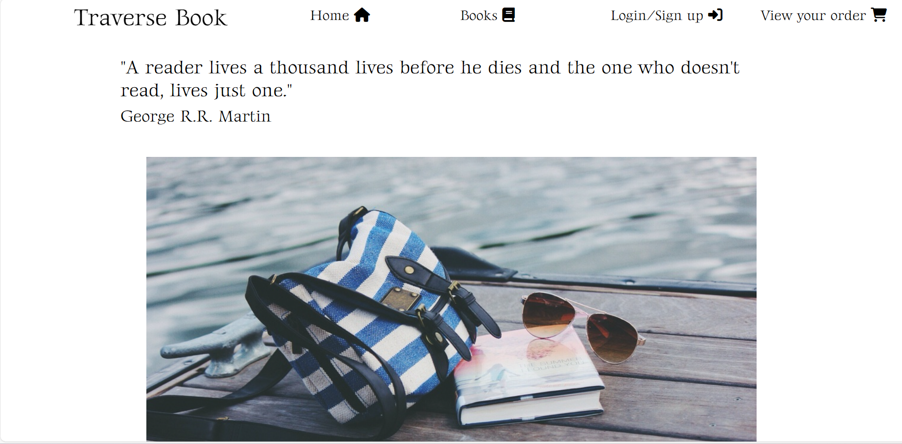

<h1>Traverse Book</h1>

Note: I have attempted to use amiresponsive but were unable to without a https url. so I used screenshot from chrome to show responsiveness

[Traverse Book](https://traverse-book-6b6199e25c96.herokuapp.com/) is a full-stack project that enables user to make order and payment on books of different genres, languages, and cover.

<h2>How to Make Order</h2>

<li>User can choose to sign in or register first, then they can navigate to the book page and make their order by clicking into the book_detail page. It will lead them to the details of the books such as authors, ISBN, publisher, page numbers. They can make their order by clicking the add to cart button.</li> 

<li>User can also filter by searching the book they like by typing the name, author, or other keywords in the search bar and clicking on the sort dropdown to sort the book by name or price in ascending or descending order. </li>

<li>After clicking the add to cart button, it will lead them to the order page which they can see the price of the book and the total price after adding the delivery cost which is 5% of the total price. There is also a button for them to proceed to checkout if they want. Otherwise, they can head back to the book page by clicking the button “Keep” shopping.</li>

<h3>Sign In page</h3>

<h3>Sign Up page</h3>

<h3>Navigation Bar at home page</h3>

<h3>Search Bar at book page</h3>

<h3>Sort book by name or price in ascending or descending order at book page
</h3>

<h3>Add to cart button in book detail page</h3>

 
 
<h3>Order page, checkout button and keep shopping button</h3>

 

<h2>Profile page</h2>

<li>The profile is only accessible by user who has account and logged in as clicking in the "My profile" link in the bottom of navigation bar.</li>
<li>User can also edit their profile and share their book interest after they have created an account.</li>
<li>After they have submitted the form. All the information will be saved and will be displayed whenever they are logged in for them to edit.<li>

<h3>My Profile in nav bar</h3>

<h3>Profile and Book Interest form</h3>

<h2>How to view Order</h2>

<li>User can click on the "View Your Order" button at the top right corner of the page to view and amend orders at navigation bar.</li>

<h3>Check Your Order button</h3>

<h2>How to check out and make payment</h2>
<li>User can check out by clicking the checkout button at the bottom of the order page.</li>
<li>It will lead the user to the checkout page where they can view their order displayed at the top of the page and a form for them to input their full name, email, phone number and address date. At the bottom of the page, there is a card payment field which enables them to type their card number, CVC code and the expiration date. </li>
<li>After submitting the payment form, there will be an authentication screen pops out by the Stripe 3D authentication to ensure that the payment is authenticated by the user. If the user declines the payment, it will lead them back to the checkout page with the form filled</li>

<li>If the payment is successful, it will lead the user to the checkout_success page where they will see the confirmation of the payment and the order number generated at the top of the page, with the order summary displayed again. The billing information is also displayed such as the order total ,delivery cost, and overall total. They can also click continue shopping if they want to shop for more.</li>

<h3>Payment form</h3>

<h3>Checkout authentication by Stripe</h3>

<h3>Checkout Success Page with the Order details rendered out</h3>

<h2>How to Delete and Edit Order</h2>
<li>User can delete order by clicking the remove button in each product in order page. After clicking it will remove the product and stay in the order page.</li>

<li> User can also adjust the number of books they want by clicking the number bar to adjust, by clicking the submit button, it will update the number of books and price automatically.</li>

<h3>Adjust button and Remove button for each product in order page</h3>

<h2>Development</h2>
<h3> Original Flowchart and Wireframe</h3>

Checkout app and Order app was added later during the coding process.

<li>In my original setting, I would like to offer user choices in filtering the books according to genre, covers, and, languages.</li>
<li>After doing more research and building the page, I realise that it would be too complicated so I simplified by only keeping the search bar.</li>
<li>I have also added a login and sign off function using django allauth functionality.</li>

<h2>Market Research</h2>

<li> The initial idea of this online bookshop comes from my personal experience as a multilingual reader living in UK. It is observable that not enough source of selling books of different languages available in English speaking countries. The title of the page “Traverse Book” wishes to represent the idea to traverse the language and cultural border and encompass more books from different languages, genre, and covers.</li>

<li>To achieve that, I have tried to input books of different languages apart from English such as Chinese, France, Japanese in order to make this available. There will be room for further development if there is more stock in my knowledge.</li>

<h3>Agile approach in development </h3>

<li>I have follow the agile approach in this project by setting up various issues to improve my project throughout the development process</li>

<h2>Testing</h2>
<li>I tested that this page works in different browser such as: Chrome, Microsoft-edge, Firefox.</li>
<li>I confirmed the project is responsive, look goods and function on all standard size screen using devtool device tool bar.</li>
<li>Code tested in my local terminal and confirmed using coverage.</li>

<h2>Bugs</h2>

<h3>Solving bugs</h3>

<li>When I tried to build the stripe authentication. I realise that it is not working and the payment is not submitted successfully. Upon checking, I realise the id I have in the stripe_element.js does not match the one I have in the checkout.html. After uniting it, I can see the screen popped out with a valid card inputted.</li>

<li>When I am building the order.html, I cannot render the order to the template. After checking with mentor, I realise the problem is in the context because I previously added the order model in the Order app which confused the Django with the context tag “order” which I used to render the order in order.html. Therefore, I changed the context tag to item and moved the order model to checkout app, it has become available since then.</li>

<h2>Validation Testing</h2>
<li>HTML: No error was found using official W3C Validator.</li>
<li>CSS: No error was found using official W3C Validator.</li>
<li>Accesssibility: I confirm the design and layout of the page is easy to read and accessible by running it through lighthouse in devtools.
</li>
<li>PEP8: No Errors return from https://pep8ci.herokuapp.com/# </li>

<h2>Deployment</h2>

The page is deployed using heroku, following the below steps:

<li> Install the heroku CLI in IDE terminal</li>
<li>Install Project requirements app </li>
<li>Create the heroku app</li>
<li>Create a database in ElephantSQL</li>
<li>Connecting our Remote Database</li>
<li>Pushing changes to Github</li>
<li>Fix ALLOWED_HOSTS and Run the Project</li>
<li>Connecting Heroku to Github</li>
<li>Set The SECRET_KEY in setting.py</li>
<li>Once the link is deployed, the link is generated</li>

The link is below https://traverse-book-6b6199e25c96.herokuapp.com/

<h2>Credit</h2>

<h3>Code</h3>

<li>Model structure has been advised by my mentor Juliia Konovalov. Many Thanks for his patient and helpful guidance.</li>

<li> adjusting and deleting order, checkout app and templates, filter and searching, payment structure are inspired by tutorial of Boutique Ado project in Code Institute course.

[Boutique_Ado_Github]( https://github.com/Code-Institute-Solutions/boutique_ado_v1/tree/250e2c2b8e43cccb56b4721cd8a8bd4de6686546)
</li>

<li>testing format has been inspired by handout of Hello Django project in Code Institute modules

[Hello Django: Part 8: Testing](https://docs.google.com/document/d/1L7zyIXL1wCki2eOoDZPCw9fIIe93NfdCiA_mbht9P8A/edit#heading=h.hvy9tw74f1o0)

</li>

<h3>Media</h3>

<h4>Index.html</h4>

https://pxhere.com/en/photo/105434/

https://toistudent.timesofindia.indiatimes.com/news/bookmark/a-reader-lives-a-thousand-lives/5748.html#:~:text=%22A%20reader%20lives%20a%20thousand,kept%20close%20to%20my%20heart.

<h4>book.html</h4>

https://www.amazon.co.uk/Runaway-Vintage-International-Alice-Munro/dp/1400077915

https://www.amazon.co.uk/Poetics-Penguin-Classics-Aristotle-ebook/dp/B002RI92L6

https://www.amazon.co.uk/Communist-Manifesto-introduction-Varoufakis-Classics/dp/1784873691

https://www.ebay.co.uk/itm/394132027496

https://www.amazon.co.uk/Hamlet-Publisher-Yale-University-Press/dp/B004R97PB2

https://www.amazon.co.uk/%E5%80%A6%E6%80%A0%E7%A4%BE%E6%9C%83-Traditional-Chinese-%E9%9F%93%E7%82%B3%E5%93%B2-ebook/dp/B081GY35YC

https://www.abebooks.co.uk/book-search/author/w-h-d-adams/

https://www.amazon.co.uk/Photography-Penguin-Modern-Classics-ebook/dp/B00P1SOF70

https://www-origin.abebooks.com/servlet/BookDetailsPL?bi=30826078551&searchurl=rr%3Don%26fe%3Don%26ds%3D10%26sortby%3D17%26isbn%3D9780394743646&cm_sp=msrp-_-msrpdesc-_-bdp

https://www.abebooks.co.uk/9781852244132/New-Collected-Poems-Winner-2011-1852244135/plp

https://www.ebay.co.uk/p/90344570

https://www.amazon.co.uk/Story-Art-Pocket-Gombrich-2006-10-07/dp/B00CF5WARY

https://www.amazon.co.uk/Histoire-beaut%C3%A9-Umberto-Eco/dp/2081243288

https://www.amazon.co.uk/Less-Than-One-Selected-Twentieth/dp/0141180110

https://www.amazon.co.uk/Time-Mother-Ocean-Vuong/dp/1787333841

https://www.ebay.co.uk/itm/304671395331

https://www.amazon.co.uk/Mirror-Dance-Catriona-McPherson/dp/152933795X

https://www.amazon.co.uk/King-Lear-Arden-Shakespeare-William/dp/1903436591

https://www.amazon.co.uk/Gender-Trouble-Routledge-Classics-Judith/dp/0415389550
 

https://www.amazon.co.uk/Gaga-Feminism-Gender-Normal-Action/dp/0807010979

https://www.amazon.co.uk/Dracula-Macmillan-Collectors-Library-Stoker/dp/1909621625

https://www.amazon.co.uk/Left-Hand-Darkness-S-F-MASTERWORKS-ebook/dp/B01NCU4VNT

https://www.amazon.co.uk/Illustrated-Brief-History-Time/dp/0593077180

https://www.amazon.co.uk/Never-Let-Me-Kazuo-Ishiguro/dp/0571258093

